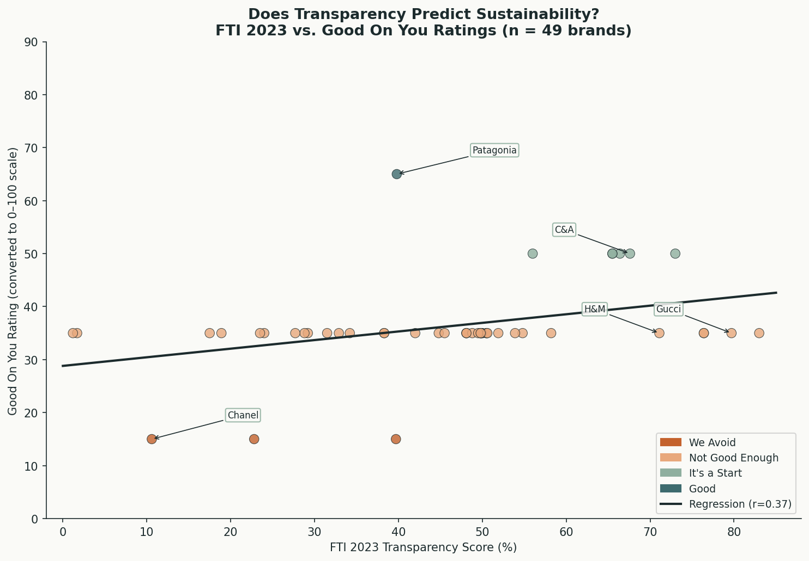
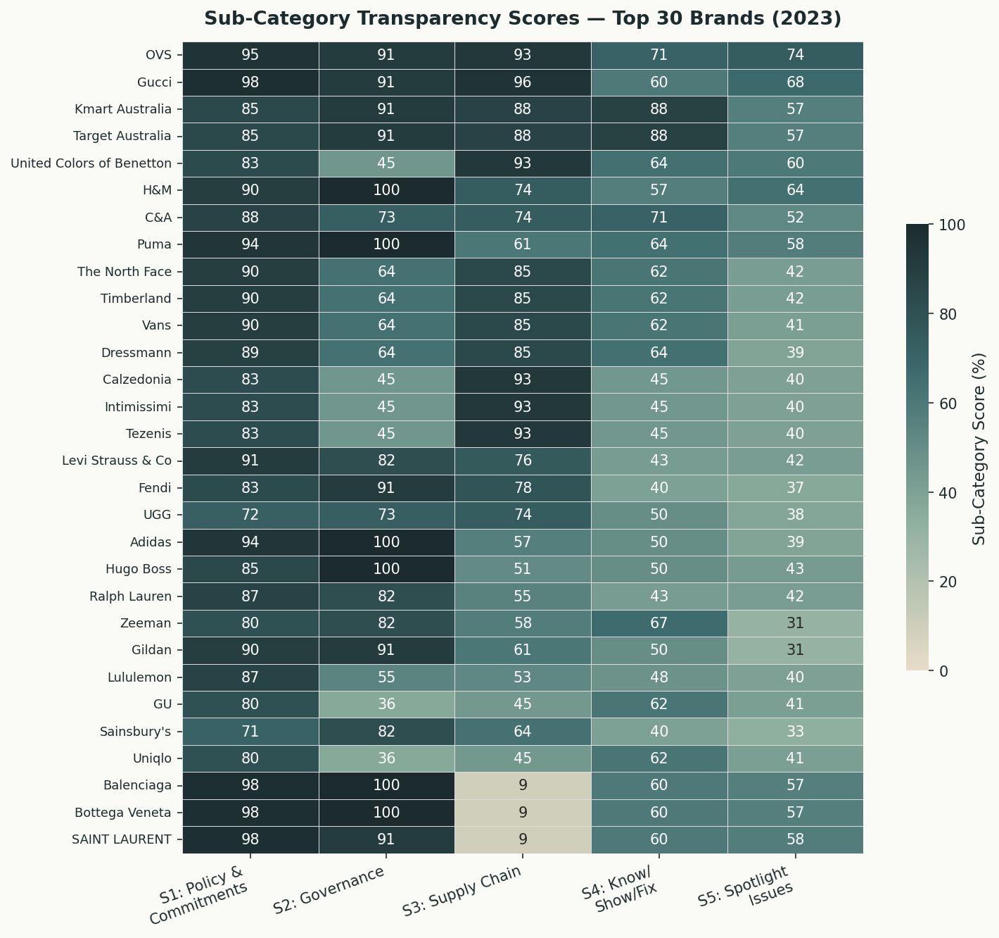
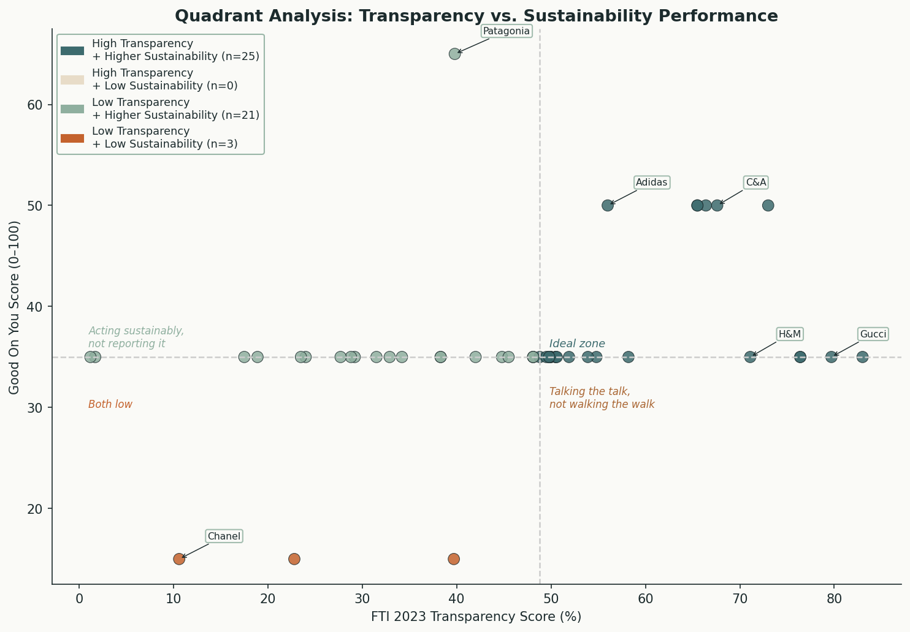
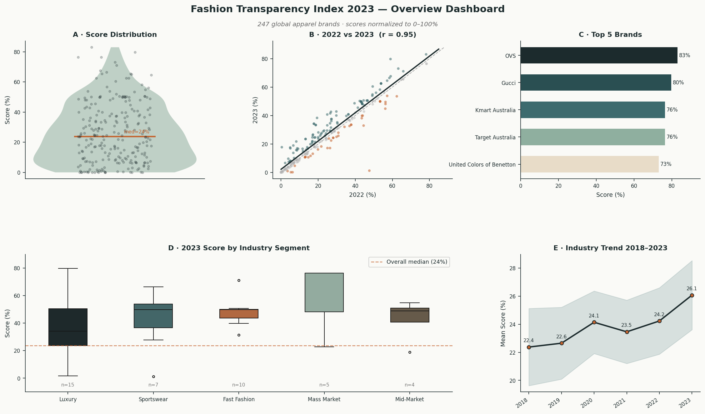

# Fashion Sustainability Analysis
### Transparency vs. Actual Sustainability in the Global Apparel Industry

A two-part data visualization project exploring what 247 of the world's largest fashion brands
actually disclose about their practices — and whether that disclosure translates into genuine
sustainability performance.

**Course:** COMP 4433 — Data Visualization  
**Author:** Namoos Haider (Moose)  
**Data sources:** Fashion Transparency Index 2023 (Fashion Revolution) · Good On You Brand Ratings (2024/25)

---

## The Core Question

The Fashion Transparency Index measures what brands *say* about their practices.
Good On You independently rates what brands *do* across people, planet, and animal welfare.
Merging both datasets for 49 overlapping brands reveals a weak but real correlation of **r = 0.37** —
meaning transparency and actual sustainability are related, but a brand can score 80% on disclosure
while still being rated "Not Good Enough" on independent assessment.

---

## Preview


*The central finding: FTI transparency vs. Good On You sustainability (r = 0.37, n = 49 brands)*


*S1–S5 sub-category scores for the top 30 brands — S3 and S5 are where everyone falls short*


*High transparency + low sustainability is the most populated quadrant*


*Full project overview — distribution, year-over-year change, top brands, segment comparison, 2018–2023 trend*

---

## Repository Structure

```
fashion-sustainability-analysis/
│
├── notebooks/
│   ├── 01_FTI_Analysis.ipynb          # Part 1: FTI 2023 exploratory analysis
│   └── 02_CrossIndex_Extension.ipynb  # Part 2: FTI × Good On You cross-index analysis
│
├── data/
│   ├── Fashion_Transparency_Index_2023_dataset_Final.xlsx
│   ├── Progress_Report_2017-2023-Final.xlsx
│   └── FINAL_Fashion_Transparency_Index_2023_Finalised_Methodology_.xlsx
│
├── figures/                           # All exported visualizations (PNG, 150 dpi)
│
├── requirements.txt
└── README.md
```

---

## Part 1 — FTI 2023 Exploratory Analysis (`01_FTI_Analysis.ipynb`)

**What it does:** Examines the distribution, year-over-year change, industry trends, and
sub-category breakdown of transparency scores across 247 global fashion brands.

**Key findings:**
- The median brand discloses only **26%** of what the FTI asks for
- Year-over-year improvement from 2022→2023 is statistically significant
  (mean +2.0pp, t = 5.25, p < 0.0001, Cohen's d = 0.33)
- Year-over-year scores are highly stable (r = 0.95) — rankings barely shift
- The industry average has risen from **22.4% → 26.1%** over 2018–2023
  (slope = +0.65pp/year, p = 0.014), but at that rate 50% average disclosure
  is ~37 years away
- **OVS** leads at 83%, not Adidas as commonly cited — a data normalization error
  in earlier analyses
- Segment differences (Luxury vs Fast Fashion vs Sportswear) are not statistically
  significant given current sample sizes (Kruskal-Wallis p = 0.57)

**Figures:**
| # | Chart | Type |
|---|-------|------|
| 1 | Score distribution | Violin + strip plot |
| 2 | 2022 vs 2023 scores | Scatter + regression |
| 3 | Year-over-year change | Strip + boxplot |
| 4 | Top 10 brands | Horizontal bar |
| 5 | Scores by industry segment | Boxplot + strip |
| 6 | Sub-category heatmap (top 30) | Heatmap |
| 7 | Industry trend 2018–2023 | Line + 95% CI band |
| 8 | Summary dashboard | 5-panel composite |

---

## Part 2 — Cross-Index Extension (`02_CrossIndex_Extension.ipynb`)

**What it does:** Merges FTI 2023 scores with Good On You sustainability ratings for
49 overlapping brands to test whether transparency predicts actual sustainability performance.

**Key findings:**
- Correlation between FTI score and GOY rating: **r = 0.37, p = 0.008** — significant
  but explaining only ~14% of variance
- The most populated quadrant: **high transparency, low sustainability** — brands
  that disclose extensively while still rating "Not Good Enough" on independent assessment
- H&M (71% FTI) and Gucci (80% FTI) both rate "Not Good Enough" on Good On You
- **Animals** is the lowest-scoring GOY dimension across all segments, especially Luxury
- The three brands rated "Good" or above by GOY (Patagonia, Eileen Fisher, Stella McCartney)
  don't qualify for the FTI — too small by revenue — which creates a structural ceiling problem

**Figures:**
| # | Chart | Type |
|---|-------|------|
| 1 | FTI vs GOY correlation | Scatter + regression |
| 2 | Top 20 FTI brands: transparency vs sustainability | Side-by-side bars |
| 3 | GOY sub-scores by industry segment | Grouped bar |
| 4 | Quadrant analysis | Annotated scatter |
| 5 | Summary dashboard | 4-panel composite |

---

## Getting Started

### Prerequisites
Python 3.9+ recommended.

```bash
git clone https://github.com/YOUR_USERNAME/fashion-sustainability-analysis.git
cd fashion-sustainability-analysis
pip install -r requirements.txt
```

### Running in Jupyter
```bash
jupyter notebook
```
Open `notebooks/01_FTI_Analysis.ipynb` and run all cells.
The notebooks use relative paths — run them from the repo root or adjust
`FILE =` in the data loading cell if needed.

### Running in Google Colab
1. Upload the three `.xlsx` files from `data/` via the Files panel (folder icon, left sidebar)
2. Change the `FILE =` path in the data loading cell to just the filename:
   ```python
   FILE = "Fashion_Transparency_Index_2023_dataset_Final.xlsx"
   ```
3. Run all cells

---

## Data Sources & Licensing

| Dataset | Source | License |
|---------|--------|---------|
| Fashion Transparency Index 2023 | [Fashion Revolution / Wikirate](https://wikirate.org/Fashion_Revolution+Fashion_Transparency_Index_2023) | CC BY-NC 4.0 |
| Good On You Brand Ratings | [goodonyou.eco](https://goodonyou.eco) | Public profiles, non-commercial research use |

The FTI rates brands on **disclosure** across 5 categories: Policy & Commitments,
Governance, Supply Chain, Know/Show/Fix, and Spotlight Issues. It does not directly
measure ethical or environmental performance — a high score means a brand publishes
detailed information, not that their practices are good.

Good On You independently rates brands on **People, Planet, and Animals** using a
1–5 scale (We Avoid → Great), drawing on certifications, audits, and public disclosures.
Three brands in the GOY dataset (OVS, Kmart Australia, Target Australia) should be
verified directly on goodonyou.eco as their profiles may be limited.

---

## Visual Design

All figures use a consistent earthy sustainability palette:

| Color | Hex | Role |
|-------|-----|------|
| Deep Forest | `#1C2B2D` | Primary |
| Teal | `#3D6B6E` | Secondary / improvement |
| Terracotta | `#C4622D` | Accent / decline |
| Sage | `#8FAF9F` | Neutral fills |
| Warm Sand | `#E8DCC8` | Light fills |

---

## Limitations

- The FTI covers 247 brands; the GOY cross-index analysis is limited to 49 overlapping brands
- GOY ratings are manually compiled from public profiles and may not reflect the most
  recent re-rating for every brand
- The FTI methodology has evolved since 2017, making direct multi-year comparisons imperfect
- Both indices rely partly on self-reported brand data; neither fully captures actual practice
- The "full methodology" FTI has not been published since 2023; Fashion Revolution has
  released climate-focused special editions in 2024 and 2025

---

## Acknowledgements

Data provided by [Fashion Revolution](https://www.fashionrevolution.org/) and
[Good On You](https://goodonyou.eco/). 
